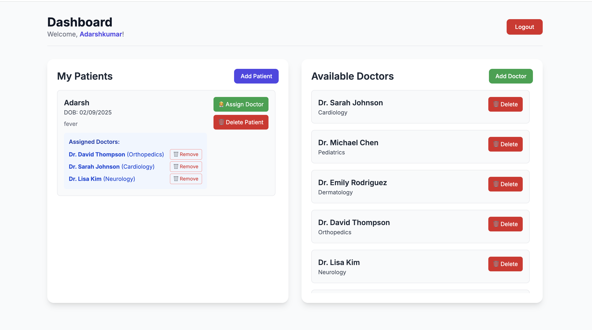

# 🏥 Healthcare Management System

[](https://nodejs.org/)
[](https://expressjs.com/)
[](https://postgresql.org/)
[](LICENSE)

> A modern, full-stack healthcare management system with clean architecture and professional design.

## ✨ Features

- 🔐 **Secure Authentication** - JWT-based user registration and login
- 👥 **Patient Management** - Complete CRUD operations for patient records
- 👨‍⚕️ **Doctor Management** - Specialist profiles with assignment capabilities  
- � **Assignment System** - Link patients to their assigned doctors
- 📱 **Responsive Design** - Modern UI that works on all devices
- 🗃️ **Database Integration** - PostgreSQL with Sequelize ORM
- 🌱 **Sample Data** - Pre-populated with realistic healthcare data

## 📸 Screenshots

### CareLink Authentication Interface


**Key Features Shown:**
- 🎨 Modern, professional healthcare branding
- 🔐 JWT-based authentication system
- 📱 Clean, responsive login/register interface
- 🏥 CareLink dashboard with medical theming
- ⚡ Tabbed navigation between Login and Register
- 🔒 Secure email and password authentication

### Patient & Doctor Management Dashboard


**Key Features Shown:**
- 👥 Patient management with CRUD operations
- 👨‍⚕️ Doctor profiles and specialization management
- 🔗 Patient-Doctor assignment and mapping system
- 📊 Real-time healthcare data display
- 🇮🇳 Sample Indian patient and doctor data
- 🎯 Modern, intuitive dashboard interface

*The complete healthcare management system showcasing secure authentication and comprehensive patient-doctor management capabilities.*

## 🚀 Quick Start & How to Run

### Prerequisites
Before running the application, make sure you have:
- **Node.js** (v14 or higher) - [Download here](https://nodejs.org/)
- **PostgreSQL** (v12 or higher) - [Download here](https://postgresql.org/download/)
- **Git** - [Download here](https://git-scm.com/downloads)

### Step 1: Clone the Repository
```bash
git clone https://github.com/Adarshkumar24/healthcare_management_system.git
cd healthcare_management_system
```

### Step 2: Install Backend Dependencies
```bash
npm run install:backend
```

### Step 3: Database Setup
1. **Create PostgreSQL Database:**
   ```bash
   # Connect to PostgreSQL
   psql -U postgres
   
   # Create database
   CREATE DATABASE healthcare_db;
   
   # Exit PostgreSQL
   \q
   ```

### Step 4: Configure Environment Variables
1. **Navigate to backend directory and create `.env` file:**
   ```bash
   cd backend
   touch .env
   ```

2. **Add the following configuration to `backend/.env`:**
   ```env
   # Database Configuration
   DB_HOST=localhost
   DB_NAME=healthcare_db
   DB_USER=your_postgresql_username
   DB_PASSWORD=your_postgresql_password
   DB_DIALECT=postgres
   DB_PORT=5432

   # JWT Configuration
   JWT_SECRET=healthcare_jwt_secret_2025_secure_key_for_authentication

   # Server Configuration
   PORT=5000

   # Node Environment
   NODE_ENV=development
   ```

   **Important:** Replace `your_postgresql_username` and `your_postgresql_password` with your actual PostgreSQL credentials.

### Step 5: Start the Backend Server
From the **root directory** of the project:
```bash
npm run start:backend
```

You should see:
```
Server is running on port 5000.
Database synced successfully.
```

### Step 6: Open the Frontend
**Option 1: Direct File Access**
```bash
# Open frontend in your default browser
open frontend/index.html
```

**Option 2: Local Web Server (Recommended)**
Open a new terminal and run:
```bash
cd frontend
python3 -m http.server 3000
```
Then visit: `http://localhost:3000`

### 🎉 Your Application is Now Running!
- **Backend API:** `http://localhost:5000`
- **Frontend App:** `http://localhost:3000` (or direct file access)
- **Database:** PostgreSQL with healthcare_db

---

## 🔄 Alternative: Automated Setup
If you prefer automated setup:
```bash
./setup.sh
```

## � Project Structure

```
healthcare-management-system/
├── 📁 backend/                 # Backend API Server
│   ├── 📁 src/
│   │   ├── 📁 config/         # Database configuration
│   │   ├── 📁 controllers/    # API route handlers
│   │   ├── 📁 middleware/     # Authentication middleware
│   │   ├── 📁 models/         # Database models
│   │   └── 📁 routes/         # API routes
│   ├── 📄 server.js          # Server entry point
│   ├── 📄 package.json       # Backend dependencies
│   └── 📄 .env.example       # Environment template
├── 📁 frontend/               # Client Application
│   ├── 📄 index.html         # Main HTML file
│   ├── 📁 css/               # Stylesheets
│   ├── 📁 js/                # JavaScript files
│   └── 📄 README.md          # Frontend docs
├── 📁 docs/                   # Documentation
├── 📄 README.md              # Project documentation
├── 📄 CONTRIBUTING.md        # Contribution guidelines
└── 📄 setup.sh               # Automated setup script
```

## 🛠️ Technology Stack

### Backend
- **Runtime**: Node.js
- **Framework**: Express.js
- **Database**: PostgreSQL + Sequelize ORM
- **Authentication**: JWT (JSON Web Tokens)
- **Security**: bcryptjs password hashing

### Frontend
- **Language**: Vanilla JavaScript (ES6+)
- **Styling**: CSS3 + Tailwind CSS
- **HTTP**: Fetch API
- **Storage**: LocalStorage

## 📊 API Endpoints

### Authentication
```
POST /api/auth/register    # User registration
POST /api/auth/login       # User login
```

### Patients
```
GET    /api/patients       # Get all patients
POST   /api/patients       # Create patient
GET    /api/patients/:id   # Get patient by ID
PUT    /api/patients/:id   # Update patient
DELETE /api/patients/:id   # Delete patient
```

### Doctors
```
GET    /api/doctors        # Get all doctors
POST   /api/doctors        # Create doctor
DELETE /api/doctors/:id    # Delete doctor
```

### Assignments
```
POST   /api/mappings             # Assign doctor to patient
GET    /api/mappings/patient/:id # Get patient's doctors
DELETE /api/mappings             # Remove assignment
```

## 🎯 Available Scripts

```bash
# Backend Management
npm run start:backend    # Start backend server (production)
npm run dev:backend      # Start backend server (development with nodemon)

# Database Management  
npm run seed:all         # Add sample data to existing database
npm run seed:fresh       # Reset database and add fresh sample data

# Installation
npm run install:backend  # Install backend dependencies only
npm run install:all      # Install all dependencies
```

## 🛠️ Troubleshooting

### Common Issues & Solutions

#### 1. Port 5000 Already in Use
**Error:** `EADDRINUSE: address already in use :::5000`

**Solution:**
```bash
# Find process using port 5000
lsof -ti:5000

# Kill the process (replace XXXX with actual PID)
kill -9 XXXX

# Or use different port in .env file
PORT=5001
```

#### 2. Database Connection Failed
**Error:** `Unable to connect to the database`

**Solutions:**
- Verify PostgreSQL is running: `brew services start postgresql` (macOS)
- Check database credentials in `.env` file
- Ensure database `healthcare_db` exists
- Test connection: `psql -U your_username -d healthcare_db`

#### 3. Missing Environment Variables
**Error:** `Cannot read property of undefined`

**Solution:**
- Ensure `.env` file exists in `backend/` directory
- Verify all required variables are set
- Restart the server after .env changes

#### 4. Frontend Not Loading
**Issues:**
- API calls failing
- CORS errors

**Solutions:**
- Ensure backend server is running on port 5000
- Use local web server instead of direct file access
- Check browser console for specific errors

### Sample Data
The system comes with pre-loaded sample data:
- **5 Indian Patients:** Priya Sharma, Rajesh Kumar, Anita Patel, Vikram Singh, Meera Reddy
- **8 Specialist Doctors:** Various medical specializations

## 🧑‍🏫 For Teachers/Evaluators: Backend Verification

### Quick Backend Health Check
To verify the backend is working properly, follow these steps:

#### 1. Check Server Status
After running `npm run start:backend`, you should see:
```
Server is running on port 5000.
Database synced successfully.
```

#### 2. Test Database Connection
Open your terminal and run:
```bash
# Test if the server responds - EASIEST TEST
curl http://localhost:5000/api/health

# Expected Response:
# {"status":"OK","message":"Backend server is running successfully","timestamp":"2025-09-21T03:41:05.009Z","port":"5000","database":"Connected to PostgreSQL","version":"1.0.0"}

# Test basic connectivity
curl http://localhost:5000/

# Expected Response:
# {"message":"Welcome to the healthcare application."}
```

**Alternative for Windows users:**
Visit these URLs in your browser:
- `http://localhost:5000/api/health`
- `http://localhost:5000/`

#### 3. Verify API Endpoints
Test key endpoints using curl or browser:

**Basic Health Check (Always works):**
```bash
curl http://localhost:5000/api/health
# Expected: {"status":"OK","message":"Backend server is running successfully"...}
```

**Protected Endpoints (Require authentication):**
```bash
curl -X GET http://localhost:5000/api/patients
# Expected: {"message":"No token provided!"}

curl -X GET http://localhost:5000/api/doctors  
# Expected: {"message":"No token provided!"}
```

**Note:** The "No token provided!" response actually indicates the backend is working correctly - it's properly protecting the endpoints!

#### 4. Test Authentication Flow
**Register a new user:**
```bash
curl -X POST http://localhost:5000/api/auth/register \
  -H "Content-Type: application/json" \
  -d '{
    "username": "testuser",
    "email": "test@example.com", 
    "password": "password123"
  }'
```

**Login with the user:**
```bash
curl -X POST http://localhost:5000/api/auth/login \
  -H "Content-Type: application/json" \
  -d '{
    "email": "test@example.com",
    "password": "password123"
  }'
```

**Expected Response:** JSON with JWT token

#### 5. Database Verification
Check if data is properly stored:
```bash
# Connect to PostgreSQL
psql -U your_username -d healthcare_db

# Check tables exist
\dt

# Check sample data
SELECT COUNT(*) FROM "Patients";
SELECT COUNT(*) FROM "Doctors";
SELECT COUNT(*) FROM "Users";

# Exit
\q
```

**Expected Results:**
- Tables: Users, Patients, Doctors, PatientDoctors
- 5 patients, 8 doctors in database

#### 6. Quick Frontend Test
1. Open `frontend/index.html` in browser
2. Try registering a new account
3. Login with the account  
4. Check if dashboard loads with sample data
5. Try adding/editing a patient or doctor

### Common Success Indicators ✅
- [ ] Server starts without errors
- [ ] "Database synced successfully" message appears
- [ ] API endpoints return JSON responses
- [ ] Authentication returns JWT tokens
- [ ] Frontend can communicate with backend
- [ ] CRUD operations work through the UI

### Red Flags to Look For 🚨
- Port 5000 already in use errors
- Database connection failures
- 404 errors on API endpoints
- CORS errors in browser console
- Authentication failures
- Empty responses from API calls

## 📋 Usage Instructions

### First Time Setup
1. **Register a new account** on the frontend
2. **Login** with your credentials
3. **Explore the dashboard** with patient and doctor management
4. **Try creating, editing, and deleting** patients and doctors
5. **Test the mapping feature** to assign patients to doctors

### API Testing
You can test the API endpoints using tools like Postman or curl:

```bash
# Example: Get all patients (requires authentication)
curl -H "Authorization: Bearer YOUR_JWT_TOKEN" http://localhost:5000/api/patients
```

## 🔧 Development Setup

### Prerequisites Check
Verify you have the required software:
```bash
# Check Node.js version
node --version  # Should be v14+

# Check PostgreSQL version  
postgres --version  # Should be v12+

# Check npm version
npm --version
```

### Environment Variables
Create `backend/.env` file with these exact variables:
```env
# Database Configuration
DB_HOST=localhost
DB_NAME=healthcare_db
DB_USER=your_postgresql_username
DB_PASSWORD=your_actual_password
DB_DIALECT=postgres
DB_PORT=5432

# JWT Configuration
JWT_SECRET=healthcare_jwt_secret_2025_secure_key_for_authentication

# Server Configuration
PORT=5000

# Node Environment
NODE_ENV=development
```

### Database Setup
```bash
# Method 1: Using PostgreSQL command line
createdb healthcare_db

# Method 2: Using psql
psql -U postgres
CREATE DATABASE healthcare_db;
\q

# Verify database was created
psql -l | grep healthcare_db
```

### Running in Development Mode
```bash
# Start backend in development mode (with auto-restart)
npm run dev:backend

# Or start in production mode
npm run start:backend
```

### Loading Sample Data
```bash
# Add sample data to existing database
npm run seed:all

# Reset database and add fresh sample data  
npm run seed:fresh
```

## 📱 Frontend Usage

1. Open `frontend/index.html` in your browser
2. Register a new user account
3. Login to access the dashboard
4. Manage patients and doctors
5. Assign doctors to patients

## 🤝 Contributing

We welcome contributions! Please see [CONTRIBUTING.md](CONTRIBUTING.md) for guidelines.

1. Fork the repository
2. Create your feature branch (`git checkout -b feature/AmazingFeature`)
3. Commit your changes (`git commit -m 'Add AmazingFeature'`)
4. Push to the branch (`git push origin feature/AmazingFeature`)
5. Open a Pull Request

## 📄 License

This project is licensed under the ISC License. See [LICENSE](LICENSE) file for details.

## 🆘 Support

- 📖 [Backend Documentation](backend/README.md)
- 🎨 [Frontend Documentation](frontend/README.md)
- 🐛 [Report Issues](https://github.com/Adarshkumar24/healthcare_management_system/issues)
- 💬 [Discussions](https://github.com/Adarshkumar24/healthcare_management_system/discussions)

---

<div align="center">
Made with ❤️ for better healthcare management
</div>

### Frontend Deployment
1. Upload files to web server
2. Ensure proper CORS configuration
3. Update API URLs for production

## Security Considerations

- ✅ Password hashing with bcrypt
- ✅ JWT token authentication
- ✅ Protected API routes
- ✅ Input validation
- ✅ Environment variable protection
- ✅ HTTPS recommended for production

## Contributing

1. Fork the repository
2. Create a feature branch
3. Make changes following the coding standards
4. Test thoroughly
5. Submit a pull request

## License

This project is licensed under the ISC License.

## Support

For questions or issues, please refer to:
- Backend documentation: `BACKEND_README.md`
- Frontend documentation: `frontend/README.md`

---

**Note**: This is a development project. Ensure proper security measures and testing before using in production environments.
